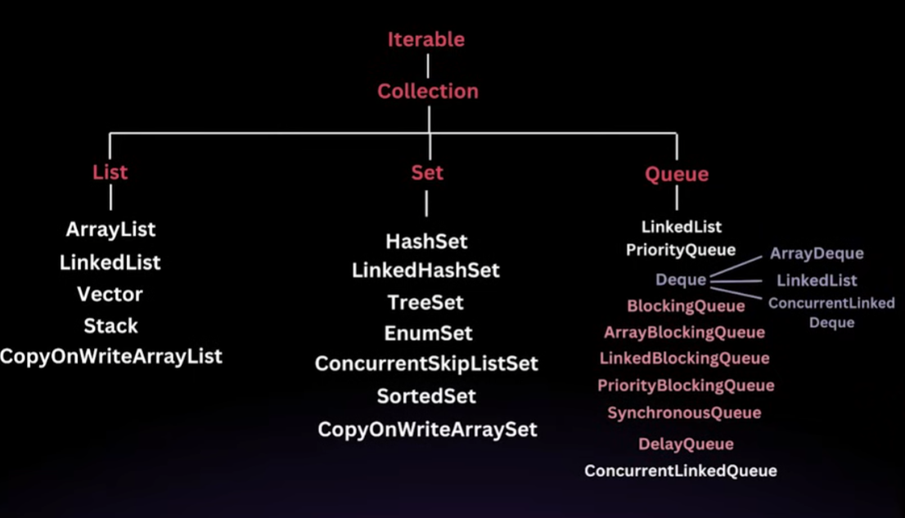

# 📝 Java Collections Framework (JCF)

## I. JCF Introduction and Hierarchy 🌳

*   **Collection Definition:** A collection is fundamentally a group of elements, which can be Strings, Numbers, or Objects.
*   **Collection Framework:** Provides standardized interfaces and classes designed to manage these collections efficiently.
*   **Pre-JCF (Java 1.2):** Development relied on legacy classes like `Vector`, `Stack`, and `Hashtable`. These classes suffered from drawbacks such as inconsistency, difficulty in management, and the lack of a common interface for inter-operation.
*   **JCF Solution:** Introduced a common set of interfaces and classes, improving interoperability and consistency.

### JCF Hierarchy Overview

*   **`Iterable`:** The absolute root interface. Any class implementing this guarantees that its objects can be used with the **`for-each` loop**.
*   **`Collection`:** The root interface for lists, sets, and queues. It provides basic operations like `size()`, `isEmpty()`, `add()`, and `remove()`.
*   **Key Interfaces (Extending `Collection`):** `List`, `Set`, `Queue`, and `Deque`.
*   **Separate Interface:** `Map` stands apart and does not extend the `Collection` interface.

## II. The List Interface 📋

The `List` interface represents an **ordered sequence** of elements and **allows duplicate elements**. Elements can be accessed by their index (index-based access).

The `List` interface in Java is a part of the java.util package and
is a sub-interface of the Collection interface. It provides a
way to store an **ordered collection of elements** (known as a
sequence). Lists allow for precise control over where
elements are inserted and **can contain duplicate elements**.

The List interface is implemented by several classes in the
Java Collection Framework, such as ArrayList, LinkedList,
Vector, and Stack.

Key Features of the List Interface-
1) Order Preservation
2) Index-Based Access
3) Allows Duplicates

## Array List

### **Internal working of Array List-** 
- Unlike a regular array, which has a fixed size, an ArrayList can grow and shrink as elements are added or removed. This dynamic resizing is achieved by creating a new array when the current array is full and copying the elements to the new array.

- When you create an ArrayList, it has an initial capacity (default is 10). The capacity refers to the size of the internal array that can hold elements before needing to resize.

**Adding Elements**

When we add an element to an ArrayList, the following steps occur

- **Check Capacity:** Before adding the new element, ArrayList checks if
there is enough space in the internal array (elementData). If the array is
full, it needs to be resized.

- **Resize if Necessary:** If the internal array is full, the ArrayList will create
a new array with a larger capacity (usually 1.5 times the current
capacity) and copy the elements from the old array to the new array.

- **Add the Element:** The new element is then added to the internal array at
the appropriate index, and the size is incremented.

**Resizing the Array**

- **Initial Capacity:** By default, the initial capacity is 10. This means the
internal array can hold 10 elements before it needs to grow.

- **Growth Factor:** When the internal array is full, a new array is created
with a size 1.5 times the old array. This growth factor balances
memory efficiency and resizing cost.

- **Copying Elements:** When resizing occurs, all elements from the old
array are copied to the new array, which is an O(n) operation, where
n is the number of elements in the ArrayList.

**Removing Elements**

- **Check Bounds:** The ArrayList first checks if the index is within the
valid range.

- **Remove the Element:** The element is removed, and all elements to
the right of the removed element are shifted one position to the left
to fill the gap.

- **Reduce Size:** The size is decremented by 1.

## Linked List

The `LinkedList` class in Java is a part of the Collection framework and
implements the List interface. Unlike an ArrayList, which uses a
dynamic array to store the elements, **a LinkedList stores its elements
as nodes in a doubly linked list**. This provides different performance
characteristics and usage scenarios compared to ArrayList.

Here are the details about the `LinkedList` discussed in the sources:

### How LinkedList Works (Conceptual Structure)

A LinkedList is a linear data structure where each element is a separate
object called a `node`. Each node contains two parts:

Data: The value stored in the node.

Pointers: Two pointers, one pointing to the next node (next) and the other
pointing to the previous node (previous).

___

### Performance Considerations

LinkedList has different performance characteristics compared to ArrayList:

**Insertions and Deletions:** LinkedList is better for frequent insertions and deletions
in the middle of the list because it does not require shifting elements, as in
ArrayList.

**Random Access:** LinkedList has slower random access (get(int index)) compared
to ArrayList because it has to traverse the list from the beginning to reach the
desired index.

**Memory Overhead:** LinkedList requires more memory than ArrayList because
each node in a linked list requires extra memory to store references to the next
and previous nodes.

<!-- The `LinkedList` class is an implementation of the `List` interface, designed to be an **ordered sequence** that allows **duplicate** elements.

The fundamental difference lies in how data is stored in memory, relying on **Nodes** and **pointers** instead of contiguous arrays:

*   **Nodes:** Each element stored in a `LinkedList` is encapsulated within a separate object referred to as a **Node**.
*   **Data and Pointers:** A Node serves as a container storing two main components: the actual **data** (the element) and one or more **pointers** or references.
*   **Sequential Linking:** These pointers store the location (address) information of the *next* Node in the sequence. This allows for sequential linking, where you follow the address stored in one Node to find the next one.
*   The system is analogized to a series of safe **lockers**; when you open the first locker, it reveals the address of the second locker, and so on.
*   If the list ends, the pointer of the last Node points to `null`.

### 2) Internal Working of LinkedList

The Java `LinkedList` is specifically implemented as a **Doubly Linked List**.

#### Internal Structure

*   In a Doubly Linked List, every Node includes **two references** or pointers: one pointing to the **next** Node and one pointing to the **previous** Node.
*   If a Node is the first element, its previous pointer is `null`. If it is the last element, its next pointer is `null`.

#### Memory and Performance Characteristics

1.  **Memory Allocation:** Elements in a `LinkedList` are **not stored in contiguous memory locations** (unlike `ArrayList` which uses a continuous block of memory). The Nodes can be scattered across various memory locations.
2.  **Insertion and Deletion:** Operations involving adding or removing elements, particularly in the middle of the list, are **quicker/easier** than in `ArrayList`.
    *   This efficiency stems from the fact that modifications only require adjusting the **pointers** of the surrounding Nodes, rather than physically shifting all subsequent elements.
    *   Methods like `addFirst`, `removeFirst`, `addLast`, and `removeLast` are highly efficient, operating in **constant time, $\text{Big O}(1)$**.
3.  **Random Access:** Accessing elements by index using methods like `get(index)` is **slower**.
    *   Because the memory is non-contiguous, the list must be **traversed (looped through)** starting from the beginning (the Head) to reach the element at the desired index.
    *   The time complexity for indexed access is **linear time, $\text{Big O}(n)$**.
4.  **Memory Overhead:** `LinkedList` requires **more memory** than array-based structures because each Node must store the extra references (pointers) to the previous and next Nodes, in addition to the data itself.

### 3) Other Important Discussion and Examples

#### Flexible Behavior (Stack and Queue)

The `LinkedList` is considered a **powerful and versatile** class because its structure allows it to easily simulate other data structures:

*   **Acting as a Queue (FIFO):** It adheres to the First In, First Out (FIFO) principle. Elements are added using methods like `addLast` (adding to the end/tail) and removed using `removeFirst` (removing from the front/head). The process of adding is called **enqueue** and removal is called **dequeue**.
*   **Acting as a Stack (LIFO):** It can implement the Last In, First Out (LIFO) principle. Elements are added using `addFirst` and removed using `removeFirst`.

#### Method Demonstration Examples

The demonstration covered standard list operations, highlighting their time complexity implications:

| Operation | Example Method | Time Complexity | Notes |
| :--- | :--- | :--- | :--- |
| **Adding at Ends** | `list.addLast(element)` or `list.addFirst(element)` | $\text{Big O}(1)$ | Efficient for Stack/Queue implementation. |
| **Removing at Ends** | `list.removeFirst()` or `list.removeLast()` | $\text{Big O}(1)$ | Efficient for Stack/Queue implementation. |
| **Random Access** | `list.get(index)` | $\text{Big O}(n)$ | Requires list traversal. |
| **Conditional Removal** | `list.removeIf(x -> x % 2 == 0)` | | Demonstrates removing elements (e.g., even numbers) based on a condition using a Predicate lambda. |
| **Peeking** | `list.getFirst()` | | Retrieves the head element without removal (used for Queue/Stack peek). |

The sources also noted that while the `LinkedList` interface has standard methods like `get(index)`, the underlying complexity of finding that element requires traversal, hence the $\text{Big O}(n)$ complexity for random access, even though the method is available.

#### Thread Safety

The `LinkedList` class is generally **not synchronized** (not thread-safe), contrasting with classes like `Vector`.

-->

### A. Core List Implementations

| Implementation | Internal Structure | Key Characteristics | Time Complexity (Worst Case) |
| :--- | :--- | :--- | :--- |
| **ArrayList** | Dynamic Array (Array of Objects) | Fast random access (O(1)). Size increases dynamically (1.5x capacity growth). Not thread-safe. | Add/Remove (O(N) due to resizing/shifting) |
| **LinkedList** | Doubly Linked List of Nodes | Ideal for frequent insertions/deletions in the middle (O(1)). Poor random access (O(N)). Higher memory overhead. | Get (O(N)); Add/Remove at ends (O(1)) |
| **Vector** | Dynamic Array | **Synchronized** (Thread-safe). Legacy class. Capacity doubles by default. | Add/Remove (O(N)) |
| **Stack** | Extends `Vector` | **LIFO** (Last In, First Out) principle. Thread-safe. | Push/Pop (O(1) average) |

### Examples and Details 📌

*   **ArrayList Resizing:** When a list is full, it creates a new internal array, typically **1.5 times** the current capacity, and copies all elements over.
*   **LinkedList Node Structure:** Each element, called a **Node**, stores the data, a pointer to the next node, and a pointer to the previous node.
*   **Stack Operations:**
    *   Adding an element: `stack.push(5)`.
    *   Removing and returning the top element: `stack.pop()`.
    *   Viewing the top element: `stack.peek()`.
*   **Arrays.asList():** Returns a list with a fixed size. You can replace elements using `set()`, but you cannot add or remove elements, which will throw an `UnsupportedOperationException`.

### B. Thread-Safe List Alternatives (Concurrent)

*   **CopyOnWriteArrayList:**
    *   Mechanism: Creates a **new copy** of the underlying array for *every* write operation (add, remove).
    *   Advantage: Provides thread safety and prevents `ConcurrentModificationException` during iteration while modifying.
    *   Use Case: Highly efficient for **read-intensive** applications where writes are rare.

## III. The Map Interface (Key-Value) 🔑

`Map` stores data in unique **Key-Value pairs**. Keys must be unique, but values can be duplicates or null.

### A. HashMap and Internal Structure 🧠

*   **Order:** No guaranteed order. Not thread-safe.
*   **Performance:** Average O(1) time complexity for `get()` and `put()`.
*   **Internal Working:**
    1.  **Hashing:** The key's `hashCode()` is used to calculate a unique hash code.
    2.  **Indexing:** The hash code is used to determine the index (bucket) in the internal array (`Hash Code % Array Size`).
    3.  **Collision:** When different keys map to the same bucket, it is handled using a **Linked List** or, if the bucket size exceeds a threshold (default 8 in Java 8+), a **Red-Black Tree**.
    4.  **Rehashing:** The internal array is resized (doubled) when the number of entries exceeds (Capacity * Load Factor, default 0.75).

*   **Custom Key Requirement:** If a custom object is used as a key, it must override `hashCode()` and `equals()` to ensure proper behavior during retrieval and comparison.

*   **Iteration Examples:**
    *   Iterating over keys: `map.keySet()`.
    *   Iterating over entries (key-value pairs): `map.entrySet()`.

### B. Other Map Implementations

| Implementation | Internal Structure | Key Characteristics |
| :--- | :--- | :--- |
| **LinkedHashMap** | Extends `HashMap`, adds a Doubly Linked List | Maintains **Insertion Order**. Can be set to maintain **Access Order** (`accessOrder=true`) for LRU caching. |
| **TreeMap** | Red-Black Tree (Self-Balancing Binary Search Tree) | Keys are always **Sorted** (Natural Ordering or `Comparator`). Time complexity is O(log N). |
| **IdentityHashMap**| Array (similar to `HashMap`) | Uses **reference equality (`==`)** for comparison and **Object's default hash code** (based on memory address), ignoring custom `equals()`/`hashCode()`. |
| **WeakHashMap** | Array (similar to `HashMap`) | Keys are held by weak references. Keys are eligible for garbage collection if no strong references exist, useful for memory-sensitive caches. |
| **EnumMap** | Internal Array | Highly efficient when keys are `enum` constants. Uses the enum's ordinal value for indexing, bypassing hashing. |

### C. Concurrent Maps

*   **Hashtable:** Synchronized (single lock), slow, does not allow null keys or values.
*   **ConcurrentHashMap:** High-performance thread-safe map.
    *   Java 8+ uses **Compare-and-Swap (CAS)** instead of segmentation for most operations, maximizing concurrency. Locks are only applied to specific buckets during resizing or collision handling.
*   **ConcurrentSkipListMap:** Provides a thread-safe, **sorted** map. Implemented using a **Skip List** (a probabilistic data structure that enables O(log N) operations). Acts as a thread-safe equivalent of `TreeMap`.

## IV. The Set Interface (Uniqueness) 💎

`Set` is a collection that guarantees **unique elements**.

*   **Internal Structure:** All Set implementations are internally backed by their corresponding Map implementation.
    *   The Set elements become the Map's keys, and a dummy value is stored for the value.
*   **Implementations:**
    *   **HashSet:** Backed by `HashMap` (Unordered, unsynchronized).
    *   **LinkedHashSet:** Backed by `LinkedHashMap` (Maintains Insertion Order).
    *   **TreeSet:** Backed by `TreeMap` (Elements are Sorted). It implements `NavigableSet`, allowing close-match searches.
*   **Immutable Sets:** Created using `Set.of()` (Java 9+).
*   **Thread Safety:** Use `ConcurrentSkipListSet` for high-performance thread-safe needs.

## V. The Queue and Deque Interfaces 🕒

### A. Queue (FIFO) and PriorityQueue

*   **Queue Principle:** **FIFO** (First In, First Out). Elements are added at the tail and removed from the front.
*   **Queue Implementations:** `LinkedList`, `PriorityQueue`.
*   **Method Handling (vs. Exceptions):**
    | Operation | Exception if empty/full | Returns null/false if empty/full |
    | :--- | :--- | :--- |
    | **Add** (Enqueue) | `add()` | `offer()` |
    | **Remove** (Dequeue) | `remove()` | `poll()` |
    | **Examine** (Head) | `element()` | `peek()` |
*   **PriorityQueue:**
    *   **Order:** Elements are ordered based on priority (Natural Ordering or `Comparator`). The **head** is the highest priority element.
    *   **Example:** For integers, the smallest element has the highest priority.
    *   **Internal Structure:** Implemented using a **Min Heap**.

### B. Deque (Double Ended Queue) ↔️

*   Allows insertion and removal at **both the head and the tail**.
*   **Implementations:**
    *   **ArrayDeque:** Array-backed, generally faster than `LinkedList` for queue/stack operations. Uses a **circular array** mechanism to avoid element shifting when adding/removing from the ends.
    *   **LinkedList:** Can also implement `Deque`.

### C. Blocking Queues (Thread Safety & Coordination) 🛑

These queues are designed for concurrency, specifically to handle scenarios like the Producer-Consumer problem. Operations wait (`block`) until the condition is met (space available or element present).

*   **Blocking Operations:** `put(E)` (blocks if full), `take()` (blocks if empty).
*   **Implementations:**
    *   **ArrayBlockingQueue:** Bounded (fixed size). Uses a single lock for both enqueue and dequeue operations.
    *   **LinkedBlockingQueue:** Optionally bounded. Uses **separate locks** for enqueue (producer) and dequeue (consumer), offering better throughput.
    *   **PriorityBlockingQueue:** Unbounded, priority-based. The `put` method typically does not block since space is always available.
    *   **SynchronousQueue:** Capacity of one (or zero). An insert operation must wait for a corresponding remove operation.
    *   **DelayQueue:** Elements are only retrieved after their associated delay has expired.

*   **Non-Blocking Concurrent Queue:**
    *   **ConcurrentLinkedQueue/Deque:** Thread-safe and lock-free implementations using **Compare-and-Swap (CAS)** for optimal performance, achieving high throughput.

## VI. Functional Interfaces (Java 8 Foundation) ⚙️

These interfaces are essential for Streams and Lambda Expressions.

*   **Predicate (`T` -> `boolean`)**: Holds a condition and returns a boolean value.
    *   *Example:* `Predicate<String> startsWithA = s -> s.startsWith("A");`.
*   **Function (`T` -> `R`)**: Takes an argument (T) and returns a result (R), performing transformation.
    *   *Example:* `Function<Integer, Integer> square = x -> x * x;`.
*   **Consumer (`T` -> `void`)**: Takes an argument but returns nothing; it consumes the input (e.g., printing).
    *   *Example:* `Consumer<String> print = System.out::println;`.
*   **Supplier (`void` -> `T`)**: Returns a result but takes no arguments.
    *   *Example:* `Supplier<String> hello = () -> "Hello World";`.
*   **Method References (Shortcut):** A concise way to refer to methods or constructors without writing a full Lambda expression.
    *   *Example:* `list.forEach(System.out::println);`.

## VII. Streams (Java 8) 🚀

Streams are a feature introduced in Java 8 to process collections in a functional and declarative manner.

### A. Stream Lifecycle

A stream operation consists of three parts:
1.  **Source:** The collection/array being converted (`list.stream()`).
2.  **Intermediate Operations:** Zero or more operations that transform the stream (`filter()`, `map()`).
3.  **Terminal Operation:** Exactly one operation that produces a final result or side effect and **closes the stream**.

### B. Intermediate Operations (Lazy) 💤

Intermediate operations are **lazy**; they are not executed until a terminal operation is called.

| Operation | Purpose & Functional Interface | Example |
| :--- | :--- | :--- |
| **`filter`** | Selects elements based on a `Predicate` | `stream.filter(x -> x % 2 == 0)` |
| **`map`** | Transforms elements based on a `Function` | `stream.map(String::toUpperCase)` |
| **`flatMap`** | Transforms elements and flattens nested structures (List of Lists) into a single stream | `stream.flatMap(List::stream)` |
| **`sorted`** | Sorts elements (natural order or custom `Comparator`) | `stream.sorted()` |
| **`distinct`** | Removes duplicate elements | `stream.distinct()` |
| **`limit` / `skip`** | Restricts the number of elements or skips elements from the start | `stream.skip(10).limit(5)` |
| **`peek`** | Performs an action (like printing) on each element without terminating the stream | `stream.peek(System.out::println)` |

### C. Terminal Operations (Eager) 🏁

Terminal operations trigger the execution of all preceding lazy intermediate operations. Streams cannot be reused after a terminal operation.

| Operation | Purpose | Example |
| :--- | :--- | :--- |
| **`collect(Collector)`** | Accumulates results into a collection or summary | `stream.collect(Collectors.toList())` |
| **`count`** | Returns the total number of elements | `stream.count()` |
| **`reduce`** | Combines elements into a single value (e.g., sum, product) | `stream.reduce(Integer::sum).get()` |
| **`forEach`** | Performs an action on each element (side effect) | `stream.forEach(System.out::println)` |
| **Matching** | `anyMatch`, `allMatch`, `noneMatch` (short-circuiting) | `stream.anyMatch(x -> x > 10)` |
| **Finding** | `findFirst`, `findAny` (short-circuiting) | `stream.findFirst().get()` |
| **`max` / `min`** | Returns the maximum or minimum element based on natural order or a `Comparator` | `stream.max(Comparator.naturalOrder())` |

### D. Collectors Utility Class 💡

The static `Collectors` utility class provides numerous specialized collection methods.

*   **Basic Collection:** `Collectors.toList()`, `Collectors.toSet()`.
*   **Joining:** Concatenates elements into a single string, often with a delimiter.
*   **Summarizing:** Calculates aggregate statistics (count, sum, min, max, average).
*   **Grouping:** `Collectors.groupingBy()`: Groups elements into a `Map` based on a classification criteria (e.g., grouping words by length).
*   **Partitioning:** `Collectors.partitioningBy()`: Splits elements into two groups (`Map<Boolean, List>`) based on a `Predicate`.

### E. Parallel Streams

*   **Mechanism:** Splits the stream into multiple sub-streams, allowing different parts of the data to be processed concurrently by different threads.
*   **Creation:** `collection.parallelStream()`.
*   **Performance:** Significantly improves performance for **large datasets** with **CPU-intensive** and **independent** tasks.
*   **Caution:** Should not be used for tasks relying on sequential order or when elements are interdependent (like cumulative sum), as it can lead to inconsistent results.

***

**Analogy for Streams:**

The stream pipeline is like an **assembly line** 🏭. The **Source** is the starting material. **Intermediate Operations** (`filter`, `map`) are the processing steps (e.g., painting, cutting, drilling) that prepare the component but don't produce a final product (Lazy). The **Terminal Operation** (`collect`, `count`) is the final step that consumes the materials and produces the finished item, triggering the entire assembly line to run (Eager).